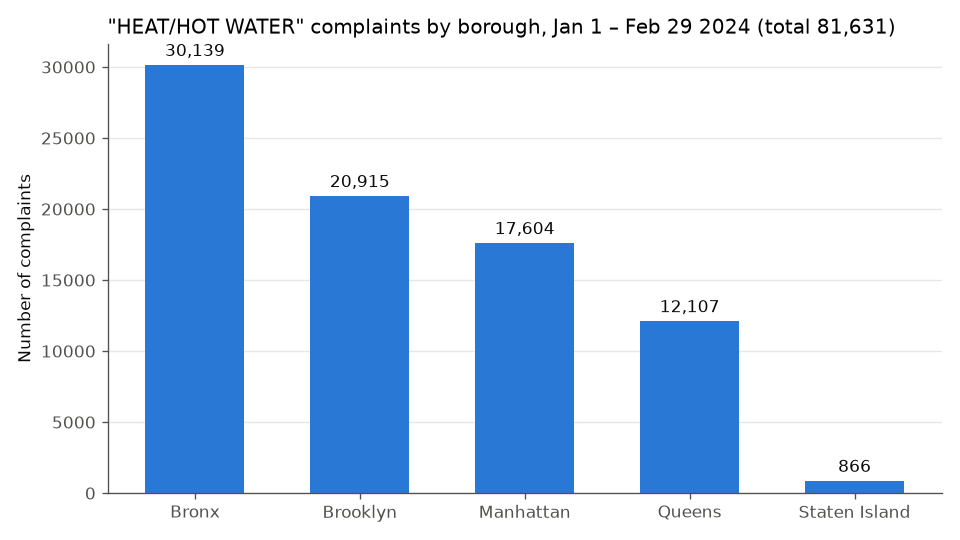
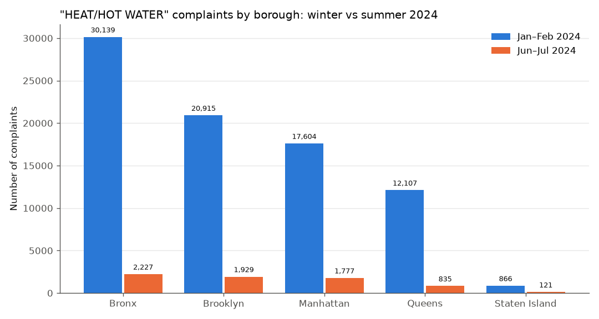

# Task 3 – Complaint type analysis

**Data:** NYC 311 service requests *created* in 2024 that have a zipcode (3,423,947 incidents), trimmed with `trim_2024.sh`.
**Method:** I ran `borough_complaints.py` from Jupyter (`task3_complaint_analysis.ipynb`) for two periods:

```
python borough_complaints.py -i nyc_311_2024.csv -s 2024-01-01 -e 2024-02-29 -o jan_feb_2024.csv
python borough_complaints.py -i nyc_311_2024.csv -s 2024-06-01 -e 2024-07-31 -o jun_jul_2024.csv
```

Then I summed the per-borough counts to get citywide totals per complaint type.

## Most abundant complaint type, Jan–Feb 2024: `HEAT/HOT WATER`

| Rank | Complaint type | Jan 1 – Feb 29, 2024 | Share of all complaints |
|---|---|---:|---:|
| 1 | **HEAT/HOT WATER** | **81,631** | **15.6%** |
| 2 | Illegal Parking | 79,916 | 15.3% |
| 3 | Noise - Residential | 43,601 | 8.4% |
| 4 | Blocked Driveway | 28,608 | 5.5% |
| 5 | UNSANITARY CONDITION | 19,206 | 3.7% |

HEAT/HOT WATER is the top complaint only narrowly. It's about 1,700 complaints (2%) ahead of Illegal Parking.



| Borough | Jan–Feb 2024 | Jun–Jul 2024 | Per day, Jan–Feb (60 days) | Per day, Jun–Jul (61 days) | Change |
|---|---:|---:|---:|---:|---:|
| Bronx | 30,139 | 2,227 | 502.3 | 36.5 | −92.6% |
| Brooklyn | 20,915 | 1,929 | 348.6 | 31.6 | −90.8% |
| Manhattan | 17,604 | 1,777 | 293.4 | 29.1 | −89.9% |
| Queens | 12,107 | 835 | 201.8 | 13.7 | −93.1% |
| Staten Island | 866 | 121 | 14.4 | 2.0 | −86.0% |
| **All boroughs** | **81,631** | **6,889** | **1,360.5** | **112.9** | **−91.6%** |



## What the analysis revealed

1. **HEAT/HOT WATER is a strongly seasonal complaint.** It goes from the #1 complaint in Jan–Feb (81,631, about 1,360 per day) to only 6,889 in Jun–Jul (about 113 per day). That's a 91.6% drop, and it falls to **#25** among complaint types. This matches NYC's legal "heat season" (October 1 – May 31), when landlords must keep apartments heated. In summer, the only complaints left are about *hot water*, which is required year-round. That explains why the count doesn't fall to zero.

2. **The drop is consistent across every borough** (−86% to −93%), so it's driven by the season, not by a change in any single borough.

3. **The Bronx carries a disproportionate share of heating complaints.** It has the most HEAT/HOT WATER complaints in both periods (37% of the citywide total in Jan–Feb). Yet it has only about 1.4M residents, versus about 2.6M in Brooklyn and about 2.3M in Queens. Roughly normalized by 2020 census population, the Bronx files about 2,100 heat complaints per 100k residents in Jan–Feb. Manhattan files about 1,100, Brooklyn about 800, Queens about 520, and Staten Island about 180. This points to housing-quality and landlord-compliance problems concentrated in the Bronx's rental stock. It's the kind of geographic disparity the zipcode dashboard (Task 4) is designed to explore.

4. **The rest of the top complaints are different in summer.** In Jun–Jul, Illegal Parking (86,237) is #1, followed by Noise - Residential (58,196) and Noise - Street/Sidewalk (47,318). Street/sidewalk noise isn't even in the winter top 10 and appears once people are outdoors. Illegal Parking, Blocked Driveway and Unsanitary Condition stay roughly flat year-round. In short, the composition of 311 demand shifts with the seasons: heat dominates in winter and noise in summer. An agency like HPD needs to staff heating inspections for winter peaks that are about 12× its summer load.

**Caveats:** Counts are complaints, not distinct problems. One unheated building often produces many complaints from different tenants, so heat counts overstate the number of affected buildings. Incidents without a zipcode were excluded by the trim (as the assignment requires), and 433 incidents with borough "Unspecified" don't appear in the per-borough charts.
